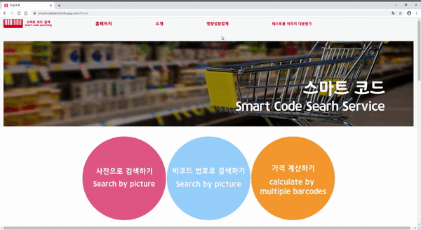

# LOTTE X LIKELION 8기 HACKATHON

   

# 두리

인천대학교 이명현, 이재윤

## [롯데푸드 스마트코드](http://smartcodelee.herokuapp.com/) 

## 개요

`스마트 코드`는 바코드의 사진이나 코드를 이용해서 가격, 성분, 열량 등의 서비스를 집에서도 간편하게 찾아 볼 수 있게 제공하는 서비스입니다.😀😀😀

## 소개 자료

#### [바로가기](https://drive.google.com/file/d/1JkoeM0pJ5CML1XJhlv6k7esTzUaeE3Hn/view)

## 기능

-   [x] 사진을 통해서 제품 검색
-   [x] 바코드를 통해서 제품 검색
-   [x] 바코드를 통해서 제품 검색
-   [x] 여러 사진을 통해서 제품 영양성분 총 합계 계산

## 왜 스마트코드를 쓸까?

- 제품에 대한 커뮤니티를 활성화하여 고객의 요구사항과 어떤 것을 선호하는지에 대한 데이터를 얻을 수 있습니다. 따라서 고객을 더 잘 알고 변화하는 고객의 필요에 신속히 대응하도록 노력할 수 있습니다. 
- 영양성분합계 페이지를 이용하여 먹었던 식품 혹은 먹을 식품의 영양성분의 총 합계를 보여주어 좀 더 스마트한 소비를 유도하며 헬스케어시대의 걸맞게 합니다.

## 참고

### ⭐️csv, xlsx, json파일 등으로도 데이터베이스 등록 가능하게 구현했습니다.😀
### ⭐️Heroku 무료서버 형식상 고화질 이미지 혹은 용량이 큰 이미지 업로드를 허용하지 않습니다.(특히 가격계산, 영양성분계산) 따라서 미리 준비해둔 이미지를 사용해서 검색해주시길 권장합니다.😀😀
### ⭐️테스트용 이미지 저장하고 체험하러 [바로가기](https://drive.google.com/drive/folders/1B5b0DjCKjVkdnJJaoSIEzMmewn9PU1PZ)

## Demo
#### 테스트용 이미지 다운

#### 사진으로 바코드 검색

#### 가격 총 합계

#### 영양성분 총 합계
